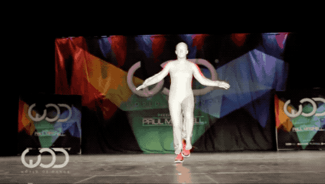
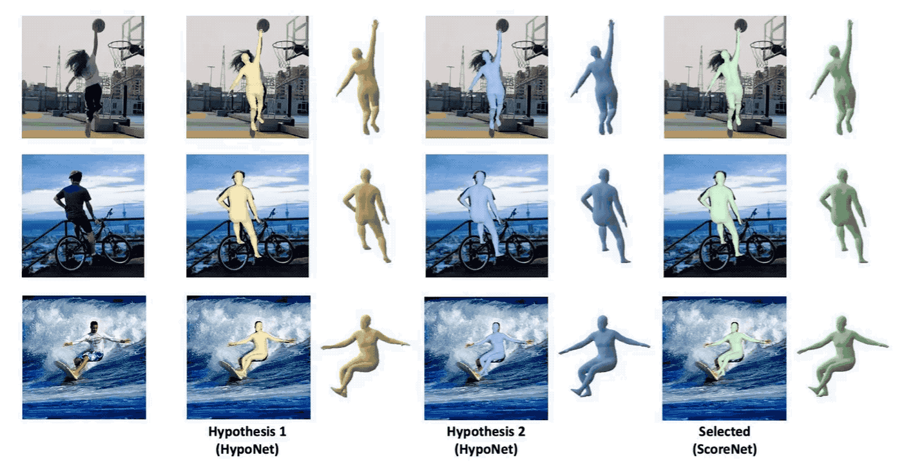
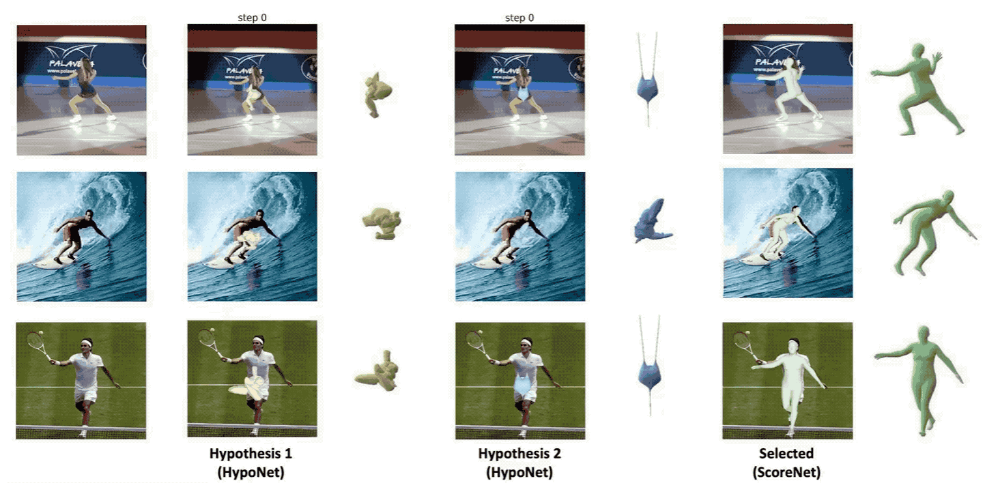

# <b>ScoreHypo</b>: Probabilistic Human Mesh Estimation with Hypothesis Scoring   (CVPR 2024)

[Yuan Xu](https://xy02-05.github.io/)1, [Xiaoxuan Ma](https://shirleymaxx.github.io/)1, [Jiajun Su](https://scholar.google.com/citations?user=DoUvUz4AAAAJ&hl=zh-CN)2, [Wentao Zhu](https://wentao.live/)1, [Yu Qiao](http://www.pami.sjtu.edu.cn/yuqiao)3, [Yizhou Wang](https://cfcs.pku.edu.cn/english/people/faculty/yizhouwang/index.htm)1

1Peking University &nbsp;&nbsp; 2International Digital Economy Academy (IDEA) &nbsp;&nbsp; 3Shanghai Jiao Tong University

#### [Project page](https://xy02-05.github.io/ScoreHypo/) · [Paper (Coming Soon)] · [Video (Coming Soon)]

  

## Code is coming soon. :star:

## Results

### Natural videos

   
   
   
   

### Multi-hypotheses & ScoreNet

   

### Diffusion process

   

