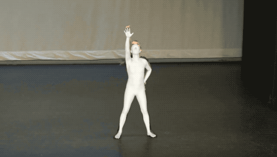

<div align="center">

# <b>ScoreHypo</b>: Probabilistic Human Mesh Estimation with Hypothesis Scoring <br> (CVPR 2024)

[Yuan Xu](https://xy02-05.github.io/)<sup>1</sup>, [Xiaoxuan Ma](https://shirleymaxx.github.io/)<sup>1</sup>, [Jiajun Su](https://scholar.google.com/citations?user=DoUvUz4AAAAJ&hl=zh-CN)<sup>2</sup>, [Wentao Zhu](https://wentao.live/)<sup>1</sup>, [Yu Qiao](http://www.pami.sjtu.edu.cn/yuqiao)<sup>3</sup>, [Yizhou Wang](https://cfcs.pku.edu.cn/english/people/faculty/yizhouwang/index.htm)<sup>1</sup>

<sup>1</sup>Peking University &nbsp;&nbsp; <sup>2</sup>International Digital Economy Academy (IDEA) &nbsp;&nbsp; <sup>3</sup>Shanghai Jiao Tong University

#### [Project page](https://xy02-05.github.io/ScoreHypo/) · [Paper](https://openaccess.thecvf.com/content/CVPR2024/papers/Xu_ScoreHypo_Probabilistic_Human_Mesh_Estimation_with_Hypothesis_Scoring_CVPR_2024_paper.pdf) · [Video](https://www.youtube.com/watch?v=LhHQ1ZlpKe0)

</div>

<p align="center">
  
</p>

## Installation

1. Install dependences. This project is developed using >= python 3.8 on Ubuntu 20.04.1. NVIDIA GPUs are needed. We recommend you to use an [Anaconda](https://www.anaconda.com/) virtual environment.

```shell
  # 1. Create a conda virtual environment.
  conda create -n pytorch python=3.8 -y
  conda activate pytorch
  
  # 2. Install PyTorch >= v1.6.0 following [official instruction](https://pytorch.org/). Please adapt the cuda version to yours.
  pip install torch==1.13.1+cu117 torchvision==0.14.1+cu117 torchaudio==0.13.1 --extra-index-url https://download.pytorch.org/whl/cu117
  
  # 3. Pull our code.
  https://github.com/xy02-05/ScoreHypo.git
  cd ScoreHypo
  
  # 4. Install other packages. This project doesn't have any special or difficult-to-install dependencies.
  pip install -r requirements.txt 
```

2. Download data following the **Data** section. In summary, your directory tree should be like this

```
  ${Project}
  ├── assets
  ├── config
  ├── data 
  ├── experiment 
  ├── input
  ├── lib 
  ├── main 
  ├── model
  ├── output
  ├── README.md
  ├── requirements.txt
  `── script
```

- `assets` contains the body virtual markers in `npz` format. Feel free to use them.
- `config` contains the configurations in `yml` format.
- `data` contains SMPL-related files and soft links to images and annotations directories.
- `lib` contains kernel codes for our method.
- `main` contains high-level codes for training or testing the network.
- `models` contains pre-trained weights. Download from [Google drive](https://drive.google.com/drive/folders/1_g7FqXfN_w7Hlxay53ZrQngSkNoM3nay?usp=sharing).
- `script` contains the running scripts.
- *`experiment` will be automatically made after running the code, it contains the outputs, including trained model weights and test metrics.

## Quick demo

1. **Installation.** Make sure you have finished the above installation successfully. ScoreHypo does not detect person and only estimates  mesh, therefore please also install [VirtualPose](https://github.com/wkom/VirtualPose) following its instructions. VirtualPose will detect all the person and estimate their root depths. Download its model weight from [Google drive](https://drive.google.com/drive/folders/1Y8unp_CQnXsWr1WljAgW0rYCMGkru6Ce?usp=share_link) or [Onedrive](https://chinapku-my.sharepoint.com/:f:/g/personal/2101111546_pku_edu_cn/ElPhUt3LaJpMgv7dH7YbJ2gBHPqS7E6fQg41tszqmHbzmg?e=wyZOKW) and put it under `VirtualPose`.

```
git clone https://github.com/wkom/VirtualPose.git
cd VirtualPose
python setup.py develop
```

2. **Render Env.** If you run this code in ssh environment without display device, please do follow:

```
1. Install osmesa follow https://pyrender.readthedocs.io/en/latest/install/
2. Reinstall the specific pyopengl fork: https://github.com/mmatl/pyopengl
3. Set opengl's backend to osmesa via os.environ["PYOPENGL_PLATFORM"] = "osmesa"
```

3. **Model weight.** Download the pre-trained ScoreHypo models from [Google drive](https://drive.google.com/drive/folders/1XtgInIQc84W7K6bcWSseimlIZAuZawdR?usp=sharing). Put the weight below `model` folder and follow the directory structure. Specify the load weight path by  `sampling.ckpt`  in  `config/infer/infer_*.yaml` for `ScoreNet` and  `training.scorenet.test_path` for `HypoNet`.
4. **Input image/video.** Prepare `input.jpg` or `input.mp4`  at `input` folder. Both image and video input are supported. Specify the input path and type by arguments.
5. **RUN.** You can check the output at `output` folder.

```
# video infer
sh script/infer/infer-video.sh
# image infer
sh script/infer/infer-image.sh
```

## Train & Eval

### Data

The `data` directory structure should follow the below hierarchy. Please download the images from the official sites. Download all the processed annotation files and SMPL-related files from [Google drive](https://drive.google.com/drive/folders/1crrOXR101uQJOBvX4TJNw-94SdGVkWHE?usp=sharing).

```
${Project}
|-- data
    |-- 3dhp
    |   |-- annotations
    |   `-- images
    |-- coco
    |   |-- annotations
    |   `-- images
    |-- h36m
    |   |-- annotations
    |   `-- images
    |-- pw3d
    |   |-- annotations
    |   `-- imageFiles
    |-- mpii
    |   |-- annotations
    |   `-- images
    |-- up3d
    |   |-- annotations
    |   `-- images
    |-- surreal
    |   |-- annotations
    |   `-- images
    `-- smpl
        |-- smpl_indices.pkl
        |-- SMPL_FEMALE.pkl
        |-- SMPL_MALE.pkl
        |-- SMPL_NEUTRAL.pkl
        |-- mesh_downsampling.npz
        |-- J_regressor_extra.npy
        |-- J_regressor_h36m.npy
        |-- h36m_mean_beta.npy
        `-- J_regressor_h36m_correct.npy
```

### Train

Every experiment is defined by `config` files. Configs of the experiments in the paper can be found in the `./configs` directory. You can use the scripts under `script` to run.

To train the model, simply run the script below. Specific configurations can be modified in the corresponding `configs/train` file. Default setting is using 2 GPUs (80G A800). Multi-GPU training is implemented with PyTorch's [DistributedDataParallel](https://pytorch.org/docs/stable/generated/torch.nn.parallel.DistributedDataParallel.html). Results can be seen in `experiment` directory.

We conduct mix-training on H3.6M and 3DPW datasets. To get the reported results on 3DPW dataset, please first run `train-h36m.sh` and then load the final weight to train on 3DPW by running `train-3dpw.sh`. This finetuning strategy is for faster training and better performance. We further train a model for better inference performance on in-the-wild scenes by finetuning the 3DPW model on SURREAL dataset.


## Results

### Natural videos

<p align="middle">
   
   
   
   
</p>

### Multi-hypotheses & ScoreNet

<p align="middle">
   
</p>

### Diffusion process

<p align="middle">
   
</p>

## Citation

Cite as below if you find this repository is helpful to your project:

```
@inproceedings{xu2024scorehypo,
  title={ScoreHypo: Probabilistic Human Mesh Estimation with Hypothesis Scoring},
  author={Xu, Yuan and Ma, Xiaoxuan and Su, Jiajun and Zhu, Wentao and Qiao, Yu and Wang, Yizhou},
  booktitle={Proceedings of the IEEE/CVF Conference on Computer Vision and Pattern Recognition},
  pages={979--989},
  year={2024}
}
```

## Acknowledgement

This repo is built on the excellent work [VirtualMarker](https://github.com/ShirleyMaxx/VirtualMarker), [HybrIK](https://github.com/Jeff-sjtu/HybrIK) and [DDIM](https://github.com/ermongroup/ddim). Thanks for these great projects.
